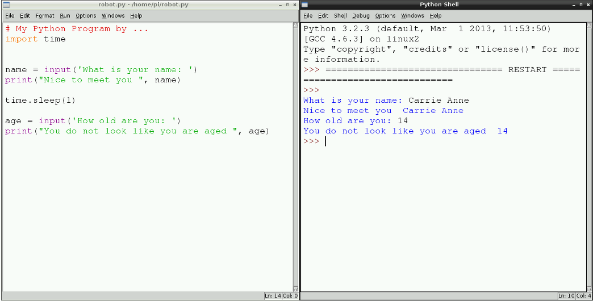

# Gwers 2 - Ydy cyfrifiaduron yn gallu meddwl dros eu hunain?

## Cyflwyniad

Bydd y wers yma yn cynnig cyflwyniad at raglennu Python drwy ysgrifennu rhaglen syml i gymryd mewnbwn defnyddiwr, ac yna printio datganiadau at y sgrîn. Mae’n adeiladu ar wers 1 wrth ddefnyddio IDLE 3 er mwyn rhaglennu yn Python 3.  


## Amcanion Dysgu

- Gwybod sut i ddadfygio cod 
- Deall y gwahaniaeth rhwng siarad gyda bod dynol a siarad gyda rhaglen gyfrifiadurol
- Gallu creu a dadfygio rhaglen gyfrifiadurol syml mewn Python gan ddefnyddio 'print' a mewnbwn defnyddiwr


## Deilliannau Dysgu

### Pob myfyriwr yn gallu:

- Ysgrifennu rhaglen Python syml a gwirio ei bod yn gweithio. 

### Y rhan fwyaf o fyfyrwyr yn gallu:

- Gwybod fod Python yn iaith raglennu gyfrifiadurol.   
- Ysgrifennu rhaglen syml Python, ac yna egluro'r dilyniant mae’n ei ddilyn.

### Rhai myfyrwyr yn gallu:

- Deall diffygion cyfrifiaduron, o’u cymharu gyda deallusrwydd dynol, wrth ddilyn dilyniant o gyfarwyddiadau.  


## Crynodeb Gwers 

- Y rhaglen Python cyntaf 

## Man dechrau

Cyfeiriwch y myfyrwyr at wefan sy’n cynnwys bot sgwrsio fel [Elbot](http://www.elbot.com/), neu arddangoswch gwefan sy’n cynnwys bot sgwrsio i’r dosbarth. Fe allech hyd yn oed ddefnyddio Siri ar ddyfais Apple. 

Gall y myfyrwyr ofyn cwestiynau i’r bot sgwrsio. Gofynnwch iddyn nhw nodi unrhyw atebion nad ydyn nhw’n cyfateb yn union gyda’r cwestiwn; er enghraifft ‘pwy yw’r chwaraewr pêl droed gorau yn y byd?’. Ar ôl munud neu ddwy, dylai’r myfyrwyr roi adborth mewn trafodaeth gyda’r holl ddosbarth.  Dylai’r athro nodi rhai o’r cwestiynau a allai fod wedi drysu'r bot sgwrsio. Ceisiwch annog y myfyrwyr i fynegi unrhyw themâu, neu resymau, pam na fyddai’r robot yn gallu ateb eu cwestiynau fel y bydden nhw’n disgwyl.

Gofynnwch i’r myfyrwyr pam ei bod mor anodd i raglenni fel rhain ddeall a rhyngweithio gyda bodau dynol. Pam eu bod nhw mor hawdd i’w drysu? Ceisiwch annog y myfyrwyr i sylweddoli fod cyfrifiaduron yn gweithredu neu’n rhedeg rhaglenni sy’n dilyn dilyniant o gyfarwyddiadau, ac mai dim ond y dilyniant yma allan nhw ei ddilyn.   

Eglurwch gysyniad y [Prawf Turing](http://en.wikipedia.org/wiki/Turing_test) a deallusrwydd artiffisial. Eglurwch y bydd y myfyrwyr yn y wers hon yn ysgrifennu rhaglenni Python ar y Raspberry Pi er mwyn eu troi i mewn i robotiaid sgwrsio. 


## Y Prif Waith Datblygu

1. Gofynnwch i’r myfyrwyr osod eu cyfarpar Raspberry Pi, ei droi ymlaen a mewngofnodi i’w Pi gan ddefnyddio yr enw defnyddiwr 'pi' a’r cyfrinair 'raspberry'.

	*Nodwch na fydd y myfyrwyr yn gallu gweld unrhyw destun wrth deipio’r cyfrinair, bydd angen i chi roi sicrwydd iddyn nhw ei fod yn gweithio. Pam bod hyn yn digwydd? Cliw: beth fyddai yn digwydd petai rhywun yn edrych dros eu hysgwydd?*
	
2. Nesaf, dylai’r myfyrwyr lwytho’r amgylchedd graffigol drwy deipio 'startx'. I ddefnyddio Python, bydd angen i’r myfyrwyr gael mynediad at amgylchedd raglennu **IDLE3**. I agor IDLE3, gall y myfyrwyr un ai glicio dwywaith ar yr eicon IDLE3 ar y bwrdd gwaith neu glicio ar y **prif ddewislen** a dewis **rhaglennu**, ac yna **IDLE3**.

	

3. Arddangoswch y ffenest ddehongli IDLE i’r myfyrwyr. Eglurwch y gellir teipio yn uniongyrchol i mewn i’r ffenest ar ôl y promt, a fydd yn edrych fel hyn: '>>>'. Gelwir y ffenest hon yn ddehonglydd neu gragen (shell). Gallech deipio llinell o god ar ôl y promt a gwasgu Enter; bydd hyn yn rhedeg y llinell honno o god. Gallech arddangos hyn gyda `print("Helo Fyd!")`. Gofynnwch i’r myfyrwyr beth fydden nhw yn rhoi yn lle " Helo Fyd ". Gadewch iddyn nhw arbrofi gyda defnyddio'r ffenest ddehongli am funud neu ddwy. Eglurwch y bydd y cyfrifiadur dim ond yn dilyn un cyfarwyddiad ar y tro mewn **dilyniant**. 

4. Eglurwch i’r myfyrwyr ei bod hi’n gallu mynd yn fwy ac yn fwy blinedig defnyddio'r dehonglydd pan ydych chi'n ysgrifennu llawer o linellau o god. Felly, os ydych chi eisiau cadw eich cod, mae’n well defnyddio golygydd testun.  Dangoswch i’r myfyrwyr sut i greu ffeil golygydd testun newydd drwy glicio ar **Ffeil>Ffenest Newydd** (**File>New Window**) o’r ddewislen ar frig y ffenest **IDLE3**.  Dangoswch i’r myfyrwyr sut i gadw'r ffeil hon, drwy glicio ar **Ffeil>Dewisiadau Cadw** (**File>Save Options**) a’i henwi yn enw1.py. 

5. Gofynnwch i’r myfyrwyr deipio'r cod canlynol i mewn i ffenest y golygydd testun. Nodwch y gwahaniaeth rhwng sylw a llinell o god. Mae sylwadau yn rhan o’r rhaglen sy’n cael eu hanwybyddu gan y cyfrifiadur, fel ein bod ni yn gallu gwneud nodiadau ynglŷn â beth sy’n digwydd yn y rhaglen. 

	```python
	
	# Fy Rhaglen Python gan ....
	
	enw = input(‘beth yw dy enw: '), 
	print("Braf cwrdd â chi ", enw)
	```
	
	*Nodwch fod y bylchau cyn `“` yn y llinyn yn bwysig.* 
	
	Cadwch y ffeil fel ffeil Python drwy glicio ar **Ffeil** ac yna **Dewisiadau Cadw**, a’i henwi yn **robot**. 
	
	Yna rhedwch y ffeil drwy glicio ar **Rhedeg** ac yna **Rhedeg Modiwl**. 
	
	

6. Gall y myfyrwyr wedyn ychwanegu eu mewnbwn eu hunain a datganiadau 'print', efallai yn gofyn am oed defnyddwyr a’u hoff lliwiau. Er enghraifft, gallent ychwanegu: 

	```python
	
	oedran = input(' pa mor hen wyt ti: ')
	print("dwyt ti ddim yn edrych yn ", oedran)
	```
	Dywedwch wrth y myfyrwyr i gadw'r ffeil a rhedeg yr un cod ag o’r blaen.  
	
	
	
7.  Unwaith y bydd gan y myfyrwyr raglenni sy’n weithredol ac yn cynnwys cwestiynau lluosog, cyflwynwch y syniad o osod bylchau rhwng y cwestiynau a ofynnwyd gydag amser. Fel arfer mewn sgwrs, mae saib rhwng ateb cwestiwn a gofyn yr un nesaf. Yr amcan yw creu robot sgwrsio all rywun ei gamgymryd am berson; felly, rydym angen gosod seibiau rhwng y cwestiynau. Gellir cyflawni hyn gan ddefnyddio'r modiwl 'amser'.   I ychwanegu'r modiwl, bydd angen i’r myfyrwyr ychwanegu 'mewnforio amser' o dan y sylw a chyn y cwestiynau. Wedyn rhwng y cwestiynau bydd angen iddyn nhw ddefnyddio `amser.cysgu(1)`, lle mae gwerth 1 yn cynrychioli 1 eiliad, fel hyn: 

	

8.  Gadewch i’r myfyrwyr barhau i ysgrifennu cod i gymryd mewnbwn a phostio gwybodaeth ar y sgrin. Yna gofynnwch i’r myfyrwyr gadw eu gwaith a diffodd y Raspberry Pis drwy glicio ar y botwm **Cau i Lawr**.

## Dod i Derfyn

Gofynnwch i’r myfyrwyr ddewis tri gair newydd maen nhw wedi eu cael heddiw neu yn y gwersi diwethaf, a’u diffinio nhw. Yna gofynnwch i’r myfyrwyr ysgrifennu paragraff am bob un o’r geiriau, neu ddefnyddio tri ar unwaith. 


## Gwaith Cartref

Dylai myfyrwyr feddwl am bum cwestiwn byddent yn hoffi i’w robot sgwrsio ofyn, yn barod ar gyfer y wers nesaf.