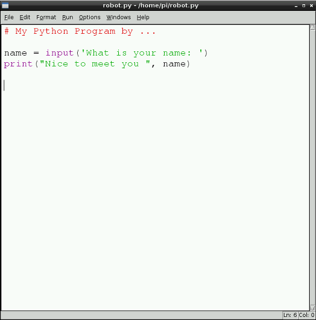
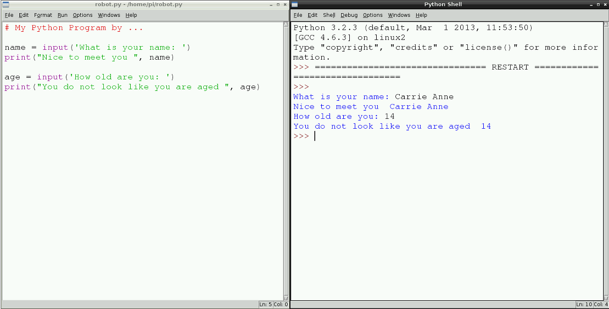
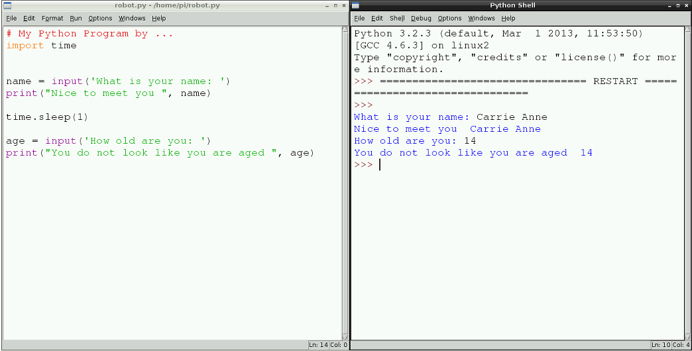

# Cyfarwyddiadau i Fyfyrwyr 2

## Cysylltu eich Raspberry Pi

Mae’r Raspberry Pi yn gyfrifiadur syml. Nid yw’n ddefnyddiol iawn ar ben ei hun. Er mwyn rhaglennu robot sgwrsio ag ef, bydd yn rhaid i ni gysylltu amryw o bethau ato.  

- **Cerdyn SD**. Mae’r cerdyn hwn yn cynnwys y rhaglenni all gael eu llwytho ar i’r Raspberry Pi er mwyn iddo allu gwneud pethau. Mae angen i chi lithro i mewn i’r slot gyda’r piniau yn gwynebu i mewn tuag at y Raspberry Pi. Dylai fod y label yn weledol pan mae wedi’i osod. 
- **Bysellfwrdd**. Plygiwch y bysellfwrdd i mewn i un o’r ddau borth USB.  Ystyr USB yw USB Universal Serial Bus. Mae’n fath o declyn cysylltu ar gyfer pob math o ddyfeisiau. Y bysellfwrdd fydd y prif fath o arf bydden ni yn ei ddefnyddio er mwyn cysylltu ein rhaglenni at y Raspberry Pi.
- **Llygoden**. Plygiwch y llygoden i mewn i’r porth USB arall. 
- **Holltwr sain**. Mae hwn yn gebl bydd yn hollti’r signal sain mewn dau gyfeiriad. Plygiwch hwn i mewn i’r jac sain ar y Raspberry Pi.
- **Clustffonau**. Bydd y rhain yn caniatáu i chi glywed y sain byddech yn ei gynhyrchu. Plygiwch y rhain i mewn i’r holltwr sain.  
- **Monitor**. Bydd hwn yn caniatáu i chi weld y rhaglen rydych chi yn ei greu. Plygiwch y cysylltwr HDMI i mewn i borth HDMI y Raspberry Pi. Plygiwch ochr arall y cebl HDMI i mewn i’ch monitor. Bydd angen i chi wneud yn sicr fod y monitor wedi’i bweru, ei fod wedi’i droi ymlaen a'i fod wedi’i osod i ddangos yr hyn sydd yn dod drwy’r cebl (yr opsiwn digidol fel arfer).
- **Addaswr pŵer**. Plygiwch yr addaswr pŵer i mewn i soced ac yna plygiwch gysylltwr USB bach i mewn i’r Raspberry Pi. Pan rydych yn troi swîts y soced ymlaen, dylech weld y Raspberry Pi yn fflachio a dylai fod testun yn ymddangos ar y monitor. 

## Mewngofnodi

1. Unwaith mae’r Raspberry Pi wedi gorffen cychwyn ac mae’r testun wedi gorffen hedfan heibio ar y sgrin, byddech yn gweld promt syml yn gofyn am eich enw defnyddiwr.  
2. Teipiwch 'pi' ac yna **Enter**. 
3. Nesaf, bydd y rhaglen yn gofyn am eich cyfrinair. Teipiwch raspberry ac yna gwasgwch Enter eto. Peidiwch â phoeni os nad ydych chi’n gweld y cyfrinair ar y sgrin wrth i chi ei deipio. Mae hwn yn nodwedd ddiogelwch er mwyn gwneud yn sicr na all pobl edrych dros eich ysgwydd a dwyn eich cyfrinair. Dylech nawr weld promt testun rhyfedd. 

## Dechrau yr amgylchedd graffigol

Mae’r promt testun rhyfedd rydych chi’n edrych arno yn un o’r ffyrdd mwyaf pwerus i gyfathrebu gyda chyfrifiadur. Fodd bynnag, nid yw’n hawdd iawn ac mae’n llawn gorchmynion rhyfedd a dirgel, yn debyg i gynnwys swyn hud. Gallwn felly symud i amgylchedd graffigol mwy cyfarwydd, gyda ffenestri a bariau dewislen, fydd gobeithio yn teimlo yn fwy cyfforddus. I wneud hyn teipiwch y swyn hud `startx` i mewn i’r derfynell testun a gwasgwch **Enter**.

## Dechrau amgylchedd rhaglennu Python 3 

Unwaith mae’r amgylchedd graffigol wedi cychwyn, gallwch glicio ar y **start menu** ar waelod ochr chwith y sgrin (mae’n edrych fel aderyn bach) a dewis **IDLE3** o’r **Programming menu**. 


## Ysgrifennu rhaglen syml 

Rydych yn mynd i ysgrifennu rhaglen er mwyn gofyn cwestiynau i’r defnyddiwr a’u hateb nhw. 

1. Dechreuwch drwy agor golygydd testun newydd a chlicio ar **File** a **New Window**.

2. Teipiwch y cod canlynol i mewn i’ch ffenest newydd gan gofio ychwanegu eich enw: 

	
	```python
	
	# Fy rhaglen Python gan ....
	
	name = input("beth yw dy enw: ")
	print("Braf cwrdd a ti ", enw)
	```
	
	*Nodwch fod y bylchau cyn yr `"` yn y llinyn yn bwysig.*   
	
	Cadwch y ffeil fel ffeil python drwy glicio ar **File** ac yna **Save As**, a’i henwi yn **robot**.
	
	Yna rhedwch y ffeil drwy glicio ar **Run** a **Run Module**.
	
	
	
	Beth ddigwyddodd?
	

3. Nawr ychwanegwch eich mewnbwn a datganiadau `print`, efallai yn gofyn am oedran neu hoff liw'r defnyddiwr. Er enghraifft, gallwch ychwanegu: 

	```python
	
	oedran = input("pa more hen wyt ti: ")
	print("dwyt ti ddim yn edrych mor hen â ", oedran)
	```
	
	*Peidiwch anghofio cadw a thestio eich cod ar ôl pob cwestiwn.*
	
	
	
4. Fel arfer mewn sgwrs, mae saib rhwng ateb cwestiwn a gofyn yr un nesaf. Yr amcan yw creu robot sgwrsio gallai rywun ei gamgymryd am berson; felly, rydym angen gosod saib rhwng y cwestiynau. Gellir cyflawni hyn gan ddefnyddio'r modiwl `time`.

	
	I ychwanegu'r modiwl, bydd angen ychwanegu `import time` o dan y sylw a chyn y cwestiynau. Wedyn rhwng y cwestiynau bydd angen iddyn nhw ddefnyddio `time.sleep(1)`, lle mae’r gwerth `1` yn cynrychioli 1 eiliad, fel hyn:
	
	```python
	# Fy rhaglen Python gan...
	import time
	
	enw = input("Beth yw dy enw")
	print("Braf cwrdd a ti ", name)
	
	time.sleep(1)
	
	oedran = input("Pa more hen wyt ti: ")
	print("Dwyt ti ddim yn edrych mor hen â ", oedran)
	```

	