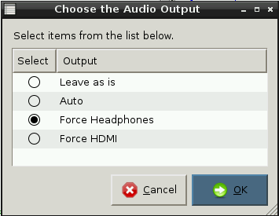

# Gwers 3 - Troi testun yn sain

## Cyflwyniad

Bydd y wers yma yn dysgu i Fyfyrwyr sut i gymryd eu rhaglenni robotiaid sgwrsio, sydd ar hyn o bryd yn argraffu y sgwrs ar y sgrin, a’u troi yn robotiaid sy’n siarad lle y bydd modd iddyn nhw glywed eu robot yn gofyn y cwestiwn.

Bydd yn rhaid i chi sicrhau bod `espeak` wedi ei lwytho i lawr a’i osod ar y cardiau SD yn defnyddio `sudo apt-get install espeak`.

Bydd angen i fyfyrwyr gael mynediad at glustffonau er mwyn clywed y synau. Falle bydd angen seinydd arnoch er mwyn arddangos i’r dosbarth.

Yn olaf, bydd yn rhaid i chi sicrhau bod sain yn cael ei orfodi i mewn i glustffonau yn hytrach na HDMI drwy deipio `amixer cset numid=3 1`, neu drwy glicio dwywaith ar yr eicon Python Games a dewis **Gorfodi Clustffonau**. 

## Amcanion dysgu 

- Adnabod a defnyddio dyfeisiau mewnbwn ac allbwn ar y Rasberry Pi.
- Gallu ychwanegu cod at y rhaglenni robot sgwrsio ar y Rasberry Pi er mwyn caniatáu iddo ddarllen testun ar lafar.
- Testio a gwerthuso y rhaglenni robot sgwrsio a grëwyd hyd yn hyn.


## Deilliannau dysgu

### Pob myfyriwr yn gallu: 

- Adnabod dyfais mewnbwn ac allbwn ar gyfrifiadur Raspberry Pi.
- Ychwanegu cod at raglen robot sgwrsio er mwyn caniatáu iddo ddarllen testun ar lafar.


### Y rhan fwyaf o fyfyrwyr yn gallu:

- Testio a chynnig adborth i’w cyfoedion ar eu rhaglen robot sgwrsio

### Rhai myfyrwyr yn gallu:

- Dyfeisio ffyrdd i wella y rhaglen robot sgwrsio drwy werthuso.  


## Crynodeb Gwers    

- Gweithgaredd labelu darnau 
- Ychwanegu testun-i-lais
- Rhaglenni Python wedi’u gwella  

## Man Dechrau

Gosodwch o leiaf pedwar set o’r canlynol, neu faint bynnag fedrwch chi eu ffeindio o bob eitem ar y rhestr, ar ddesgiau heb eu cysylltu: 

- Raspberry Pi 
- Seinydd
- Clustffonau
- Camera Pi (os oes un gennych chi) 
- Gwe Gamera
- Bysellfwrdd
- Llygoden
- Monitor 

Dosbarthwch y myfyrwyr mewn i grwpiau a rhoddwch nodiadau stici neu bapur lliw gwahanol i bob grŵp. Rhowch amser i’r myfyrwyr labelu yr holl gydrannau gyda’r wybodaeth ganlynol:

- Beth ydyw
- Y yw’n fewnbwn, proses neu ddyfais allbwn
- Yr hyn y mae'n ei wneud

Ar ôl i’r myfyrwyr labelu y cydrannau, gofynnwch i’r grwpiau egluro eu hatebion. Nodwch unrhyw rai sy’n anghywir neu yn arbennig o ddiddorol, a thrafodwch y rhesymu gyda’r dosbarth. Eglurwch fod gan bob cyfrifiadur fewnbynnau ac allbynnau. Mae’n bwysig nodi hyn ar gyfer eu rhaglen robot sgwrsio, gan fod yn rhaid iddyn nhw glywed ei leferydd yn allbynnu i’r clustffonau neu seinydd.



## Prif Ddatblygiad

1. Gofynnwch i’r myfyrwyr osod eu offer Raspberry Pi, ei droi ymlaen a mewngofnodi ar eu Pi gan ddefnyddio yr enw defnyddiwr `pi` a’r cyfrinair `raspberry`. Wedyn dylent lwytho eu rhaglenni robot sgwrsio gan ddefnyddio **IDLE3**. 
	
2.  Gan ddefnyddio eu gwaith cartref o’r wers blaenorol, cyfarwyddwch y myfyrwyr i ychwanegu mwy o gwestiynau at eu cod gan ddefnyddio `mewnbwn` ac `argraffu`.

3.  Eglurwch y bydd angen i’r myfyrwyr ychwanegu rhywfaint o god fel gall y Raspberry Pi lefaru y geiriau yn y rhaglen. Bydd angen i’r myfyrwyr ychwanegu y cod canlynol at dop eu rhaglenni:

	```python
	# My Python Program by ...
	import os, time
	
	def robot(text):
	    os.system("espeak ' " + text + " ' ")
	
	robot("Hello")
	```
	*Nodwch fod y bylchau yn bwysig; dylai’r golygydd testun yn IDLE3 greu’r bylchau yn awtomatig ar eich rhan. Hefyd, mae’r bylchau rhwng y geiriau a’r defnydd o ddyfynodau yn bwysig. Ni fydd y rhaglen yn gweithio os nad ydyn nhw yno.*    

4. Gofynnwch i’r myfyrwyr arbed hwn fel ffeil newydd drwy glicio ar **File** a **Save As**, ac yna ei enwi yn **robot1**. Gallent redeg eu rhaglenni, a dylent glywed llais yn dweud “helo”! 

5. Nesaf, eglurwch ei fod hi nawr yn bosib, yn lle argraffu cwestiynau at y sgrin, i gael eu llais robot i’w llefaru nhw ac wedyn ateb.

	I wneud hyn, yn gyntaf mae angen iddyn nhw dynnu y gair 'print' ac ailosod yr enw ffwythiant `robot` yn ei le, yna tynnu y coma `,` a’i gyfnewid gyda’r symbol `+`. Gofynnwch i’r myfyrwyr gadw a thestio ar y pwynt yma. Allen nhw egluro beth sydd yn digwydd? Mae pwyntiau bonws ar gyfer unrhyw un all feddwl am ffordd i gael y robot i ofyn y cwestiynau hefyd! Yr ateb yw i ychwanegu llinell arall uwchben y llinell mewnbwn gan ddefnyddio y ffwythiant `robot`, er enghraifft: 
	
	```python
	robot('beth yw dy enw')
	name = input('Beth yw dy enw: ')
	robot("Braf cwrdd â chi " + name)
	```

	

## Plenary

Cyfeiriwch y myfyrwyr i gyfnewid seddi â phartner. Mae ganddyn nhw gwpl o funudau i destio rhaglen eu partner, ac i awgrymu o leiaf un gwelliant drwy ysgrifennu sylw drwy ddefnyddio y symbol `#`. Dylai’r myfyrwyr wedyn ddychwelyd at eu rhaglenni a gwneud y gwelliant gafodd ei argymell. 

Fel tasg estynedig, gallai myfyrwyr dynnu un llinell o god o rhaglen eu partner, newid yn ôl, a gweld os allent drwsio y cod gwallus!


