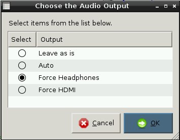

# Cyfarwyddiadau Paratoi ar gyfer Athrawon

Ar gyfer y cynllun gwaith hwn bydd y myfyrwyr angen mynediad at: 

- Raspberry Pi
- Bysellfwrdd a llygoden wedi eu cysylltu at yr RPi
- Monitor wedi'i gysylltu at yr RPi
- Y cerdyn NOOBS SD diweddaraf gyda Raspbian wedi'i osod (cyfarwyddiadau isod)
- Espeak wedi'i lwytho i lawr a'i osod ar bob cerdyn SD (cyfarwyddiadau isod)

Ar gyfer gwers 3 bydd y myfyrwyr angen y cyfarpar ychwanegol hwn: 

- Holltwr clustffonau wedi'u cysylltu at jac sain yr RPi, os bydd y myfyrwyr yn
gweithio mewn parau ar un RPi.
- Par o glustffonau wedi'u cysylltu at yr holltwr, neu RPi, fesul myfyriwr.

## Llwytho i lawr a gosod NOOBS

Gellir darllen cyfarwyddiadau ynglŷn ag ymarfer gorau llwytho i lawr a gosod NOOBS yn [fan hyn](https://github.com/raspberrypi/documentation/blob/master/installation/noobs.md).

## Llwytho i lawr a gosod espeak

1. Ar ôl cychwyn, mewngofnodwch gan ddefnyddio'r enw defnyddiwr rhagosodedig `pi` a'r cyfrinair `raspberry`.
2. Ar y llinell orchymyn teipiwch: `sudo apt-get install espeak`.
3. Gwasgwch `Y` ar y bysellfwrdd pan ofynnir i chi wneud hyn. 

## Gorfodi sain at y clustffonau 

1. Gwnewch yn sicr bod eich clustffonau wedi eu plygio i mewn i borth y jac sain ar y Raspberry Pi.
2. Ar ôl cychwyn a mewngofnodi gallwch deipio'r llinell ganlynol ar y llinell orchymyn: `amixer cset numid=3 1`.
3. Fel arall, gallwch lwytho'r bwrdd gwaith drwy deipio `startx`, clicio ddwywaith ar yr eicon **Python Games**, dewis **Force headphones** a chlicio **OK**.

	
	
## Creu set o gardiau SD ar gyfer y dosbarth

Unwaith bydd y camau uchod wedi'u cwblhau, byddwch yn gallu creu copi o'ch cerdyn SD meistr ac yna ei ddefnyddio er mwyn creu set ar gyfer y dosbarth.

1. Gosodwch eich cerdyn SD meistr mewn cyfrifiadur neu liniadur gyda darllenydd cardiau SD. 
2. Ar Windows defnyddiwch ddelweddwr [Win disk 32](http://sourceforge.net/projects/win32diskimager/) i greu copi o gerdyn SD. Ar Mac OSX gallwch ddefnyddio'r gorchymyn `dd` neu [dd-gui](http://www.gingerbeardman.com/dd-gui/).
3. Tynnwch y cerdyn SD meistr a'i gadw'n ddiogel.
4. Cymerwch gerdyn SD cerdyn gwag a'i osod yn eich cyfrifiadur neu liniadur. 
5. Fformatiwch y cerdyn SD ac yna, gan ddefnyddio eich meddalwedd delweddu, dewiswch y ddelwedd a'i hysgrifennu at y cerdyn.